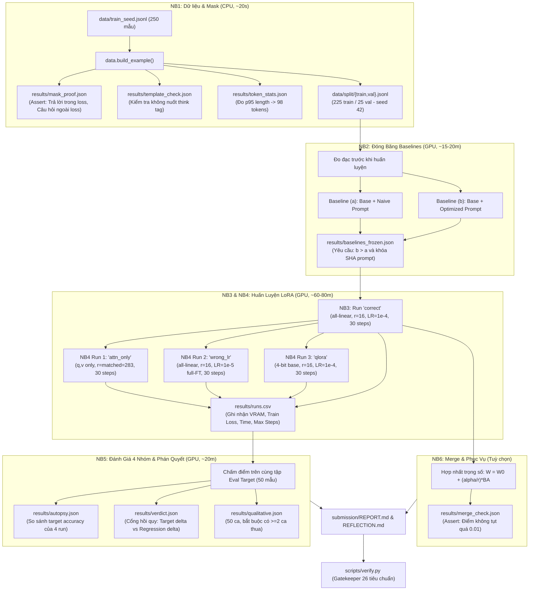

# Cẩm Nang Chi Tiết Về Lab 21 — Fine-Tuning LLMs (LoRA/QLoRA)

> **Tài liệu học tập & Hướng dẫn phương pháp luận thực chiến**  
> Dự án: [Day21-Track3-NguyenPhuongNam-2A202602869-Finetuning-Lab](file:///Users/namdev/Documents/Code/VinAI/Day21-Track3-NguyenPhuongNam-2A202602869-Finetuning-Lab)  
> Học viên: Nguyễn Phương Nam (MSSV: 2A202602869)  
> Môn học: AICB-P2T3 · Chương 5 — Fine-tuning & An Toàn

---

## 📑 Mục Lục
1. [Triết Lý Cốt Lõi: Hai Câu Hỏi Sống Còn](#1-triết-lý-cốt-lõi-hai-câu-hỏi-sống-còn)
2. [Kiến Trúc Toàn Bộ Hệ Thống](#2-kiến-trúc-toàn-bộ-hệ-thống)
3. [Phương Pháp Luận Chi Tiết Từng Khâu](#3-phương-pháp-luận-chi-tiết-từng-khâu)
   - [Khâu 1: Chuẩn hóa dữ liệu & Chứng minh Loss Mask (NB1)](#khâu-1-chuẩn-hóa-dữ-liệu--chứng-minh-loss-mask-nb1)
   - [Khâu 2: Đóng băng Baselines & Thiết lập Mốc Đánh giá (NB2)](#khâu-2-đóng-băng-baselines--thiết-lập-mốc-đánh-giá-nb2)
   - [Khâu 3: Cấu hình "Vùng Không Hối Tiếc" (LoRA Without Regret) (NB3)](#khâu-3-cấu-hình-vùng-không-hối-tiếc-lora-without-regret-nb3)
   - [Khâu 4: Giải phẫu cấu hình sai bằng thí nghiệm đối chứng (NB4)](#khâu-4-giải-phẫu-cấu-hình-sai-bằng-thí-nghiệm-đối-chứng-nb4)
   - [Khâu 5: Đánh giá bốn nhóm & Cổng hồi quy phán quyết (NB5)](#khâu-5-đánh-giá-bốn-nhóm--cổng-hồi-quy-phán-quyết-nb5)
   - [Khâu 6: Hợp nhất trọng số & Phục vụ đa Adapter (NB6)](#khâu-6-hợp-nhất-trọng-số--phục-vụ-đa-adapter-nb6)
4. [Các Phát Hiện Kỹ Thuật Đắt Giá (Simulation Findings)](#4-các-phát-hiện-kỹ-thuật-đắt-giá-simulation-findings)
5. [Quy Trình Chuẩn Khi Đi Làm Fine-Tuning Thực Tế](#5-quy-trình-chuẩn-khi-đi-làm-fine-tuning-thực-tế)

---

## 1. Triết Lý Cốt Lõi: Hai Câu Hỏi Sống Còn

Phần lớn các hướng dẫn fine-tuning trên mạng thường đi theo lối mòn: lấy dữ liệu, ném vào `SFTTrainer`, nhìn loss giảm dần, rồi kết luận "mô hình đã học tốt". Repo này được xây dựng trên một triết lý kỹ thuật hoàn toàn đối lập: **Loss giảm không đồng nghĩa với mô hình thông minh hơn, và fine-tune chưa chắc đã cần thiết.**

Repo này bắt buộc bạn phải trả lời và chứng minh bằng thực nghiệm hai câu hỏi nền tảng:

```
                  ┌─────────────────────────────────────────────────────────────┐
                  │ 1. Phần được tính loss có đúng là câu trả lời không?       │
                  │    (Kiểm chứng bằng giải mã ngược token — NB1)             │
                  └──────────────────────────────┬──────────────────────────────┘
                                                 │
                                                 ▼
                  ┌─────────────────────────────────────────────────────────────┐
                  │ 2. Bản fine-tune có thắng được Base Model đã được prompt    │
                  │    tử tế không — và bạn có phát hiện được nếu nó thua?     │
                  │    (Đo 3 baseline trước khi train & cổng hồi quy — NB2/NB5) │
                  └─────────────────────────────────────────────────────────────┘
```

### Tại sao Perplexity và Training Loss là "Chỉ Số Lừa Dối" (Proxy Metrics)?
* Một mô hình LoRA $r=283$ dồn vào vài lớp Attention có thể dễ dàng ghi nhớ vẹt (memorize) 225 câu huấn luyện, ép loss xuống cực thấp ($0.0531$). Nhưng khi đưa ra tập test thực tế, nó lại cho kết quả kém hơn mô hình có loss cao hơn ($0.0549$) nhưng phân bổ LoRA ở tất cả các lớp linear.
* Nếu chỉ chấm điểm bằng training loss hoặc perplexity, kỹ sư sẽ đưa vào sản phẩm một mô hình kém chất lượng mà vẫn tưởng mình đã tối ưu thành công.

---

## 2. Kiến Trúc Toàn Bộ Hệ Thống

Toàn bộ logic cốt lõi được đóng gói trong package [src/labkit/](file:///Users/namdev/Documents/Code/VinAI/Day21-Track3-NguyenPhuongNam-2A202602869-Finetuning-Lab/src/labkit):

```
src/labkit/
├── config.py       ← Cấu hình phần cứng (Tier), siêu tham số LoRA, prompts (NAIVE / OPTIMIZED)
├── data.py         ← Render chat template, tính toán token span, xây dựng loss mask, tính p95 length
├── device.py       ← Tự động phát hiện năng lực phần cứng (bf16 vs fp16 GradScaler vs fp32)
├── modeling.py     ← Phân tích kiến trúc lai (hybrid-attention), tính matched_rank cân bằng tham số
├── train.py        ← Lọc tham số linh hoạt cho TRL SFTTrainer, xử lý kiểu dữ liệu LoRA cho fp16
├── generate.py     ← Nạp base model, sinh văn bản theo batch có đo độ trễ và giải phóng bộ nhớ
├── evaluate.py     ← Bộ chấm 4 nhóm: Target, Regression, Format, Latency; Cổng hồi quy
└── report.py       ← Quản lý kết quả I/O, tạo bảng Markdown, ghi nhận runs.csv
```

### Dòng Chảy Thực Thi Toàn Pipeline



---

## 3. Phương Pháp Luận Chi Tiết Từng Khâu

### Khâu 1: Chuẩn hóa dữ liệu & Chứng minh Loss Mask (NB1)
*File mã nguồn:* [notebooks/01_data_and_mask.py](file:///Users/namdev/Documents/Code/VinAI/Day21-Track3-NguyenPhuongNam-2A202602869-Finetuning-Lab/notebooks/01_data_and_mask.py) | [src/labkit/data.py](file:///Users/namdev/Documents/Code/VinAI/Day21-Track3-NguyenPhuongNam-2A202602869-Finetuning-Lab/src/labkit/data.py)

#### 1. Nguyên lý Loss Masking trong Supervised Fine-Tuning (SFT)
Trong bài toán Causal Language Modeling, nếu ta tính loss trên toàn bộ chuỗi (chế độ `everything`), mô hình sẽ học cách dự đoán lại cả các token của prompt (câu hỏi của khách hàng). Hậu quả là mô hình sau khi train sẽ mắc hội chứng **"nhại lại câu hỏi"** thay vì trả lời.

Quy chuẩn SFT đòi hỏi chỉ tính Cross-Entropy Loss trên phần phản hồi của Assistant:
$$\mathcal{L} = -\sum_{t \in \text{Assistant Tokens}} \log P(x_t \mid x_{<t})$$
Mọi token nằm ngoài span của Assistant (bao gồm System Prompt, User Prompt, thẻ định dạng ChatML `<|im_start|>user`,...) phải được gán nhãn `IGNORE_INDEX = -100` để PyTorch bỏ qua trong hàm tính gradient.

#### 2. Kỹ thuật giải quyết bất ổn định tiền tố (Prefix Stability - Bug F-01)
Các tokenizer hiện đại (như Qwen3.5 BPE) có hiện tượng gộp ký tự xuống dòng: 1 ký tự `\n` là một token, nhưng 2 ký tự liên tiếp `\n\n` sẽ được gộp thành một mã token hoàn toàn khác.
* **Cách làm cũ bị sai:** Cắt danh sách token của prompt ra rồi so sánh với token của chuỗi hoàn chỉnh. Khi gặp ký tự xuống dòng ở ranh giới, token bị đổi ID, dẫn đến crash `TemplateNotPrefixStable`.
* **Giải pháp chuẩn hóa trong `labkit`:** Render toàn bộ hội thoại ra chuỗi văn bản hoàn chỉnh trước. Sau đó tokenize 1 lần duy nhất với `return_offsets_mapping=True` để lấy vị trí ký tự `(char_start, char_end)` của từng token trên chuỗi gốc. Token nào có vị trí ký tự nằm trọn trong đoạn Assistant sẽ được giữ lại tính loss.

#### 3. Kiểm chứng bằng giải mã ngược (`decode_supervised`)
Không bao giờ tin tưởng mù quáng vào code xử lý mảng. Ta dùng chính Tokenizer để giải mã ngược các token không bị gán `-100`:
```python
def decode_supervised(tok, example):
    supervised_ids = [tid for tid, lab in zip(example.input_ids, example.labels) if lab != -100]
    return tok.decode(supervised_ids)
```
Nếu chuỗi giải mã ngược chứa câu hỏi $\rightarrow$ **MASK SAI**. Nếu chuỗi giải mã ngược không có câu trả lời $\rightarrow$ **MASK SAI**. Hai assert này được ghi vào [results/mask_proof.json](file:///Users/namdev/Documents/Code/VinAI/Day21-Track3-NguyenPhuongNam-2A202602869-Finetuning-Lab/results/mask_proof.json).

---

### Khâu 2: Đóng băng Baselines & Thiết lập Mốc Đánh giá (NB2)
*File mã nguồn:* [notebooks/02_baselines.py](file:///Users/namdev/Documents/Code/VinAI/Day21-Track3-NguyenPhuongNam-2A202602869-Finetuning-Lab/notebooks/02_baselines.py) | [src/labkit/evaluate.py](file:///Users/namdev/Documents/Code/VinAI/Day21-Track3-NguyenPhuongNam-2A202602869-Finetuning-Lab/src/labkit/evaluate.py)

#### 1. Thiết kế 3 Baseline
Để chứng minh fine-tuning có giá trị, ta cần so sánh với cái gì?
* **Baseline (a) - Mốc sàn:** Base model + Naive prompt (`"Phân loại ticket sau."`). Đạt target = 0.000 vì mô hình chưa hiểu schema JSON và sinh văn bản tự do.
* **Baseline (b) - Mốc cạnh tranh thực tế:** Base model + Optimized prompt (prompt engineering kỹ lưỡng: hướng dẫn schema 4 trường, ràng buộc enum, 1 ví dụ mẫu few-shot). Đạt target = 0.760, format = 1.000.
* **Baseline (c) - Mô hình fine-tune:** Đưa vào đánh giá ở NB5.

#### 2. Nguyên tắc đóng băng (Freezing Rule)
Baseline (b) phải được đo đạc và lưu kết quả vào `results/baselines_frozen.json` **trước khi** bắt đầu huấn luyện. Đồng thời, mã băm SHA-256 của chuỗi `OPTIMIZED_PROMPT` (`719e74d3b6232053`) được ghi lại.
> **Ý nghĩa:** Tránh hiện tượng thiên kiến vô thức. Nếu cho phép đo baseline sau khi đã có kết quả fine-tune, con người sẽ có xu hướng chỉnh sửa prompt (b) yếu đi để làm nổi bật chiến thắng của mô hình fine-tune. `verify.py` kiểm tra mã SHA này để đảm bảo tính liêm chính học thuật.

---

### Khâu 3: Cấu hình "Vùng Không Hối Tiếc" (LoRA Without Regret) (NB3)
*File mã nguồn:* [notebooks/03_train_correct.py](file:///Users/namdev/Documents/Code/VinAI/Day21-Track3-NguyenPhuongNam-2A202602869-Finetuning-Lab/notebooks/03_train_correct.py) | [src/labkit/train.py](file:///Users/namdev/Documents/Code/VinAI/Day21-Track3-NguyenPhuongNam-2A202602869-Finetuning-Lab/src/labkit/train.py)

Nghiên cứu mới nhất về LoRA (Thinking Machines 2025 / VinAI Day 21) đúc kết cấu hình chuẩn "vùng không hối tiếc" (Low-Regret Configuration):

| Siêu tham số | Thiết lập chuẩn | Căn cứ lý thuyết |
|---|---|---|
| **Vị trí gắn adapter** | Toàn bộ lớp Linear của text decoder (`text-linear`) | Gắn vào 12 module (cả Gated DeltaNet linear attention và feed-forward), không chỉ gắn vào $q, v$. Loại trừ vision tower của model đa phương thức. |
| **Learning Rate** | $\approx 10\times$ Full-FT LR ($1\times 10^{-4}$) | Do trọng số gốc bị đóng băng hoàn toàn, chỉ có ma trận rank nhỏ thích nghi nên cần bước nhảy lớn hơn. |
| **Effective Batch Size** | $< 32$ (ở lab này chọn 16) | LoRA chịu đựng batch lớn kém hơn Full-FT; tăng rank không khắc phục được suy giảm này. |
| **Alpha invariant** | $\alpha = 2r$ | Giữ tỷ lệ co giãn $\frac{\alpha}{r} = 2.0$ ổn định khi điều chỉnh rank. |
| **Độ chính xác phần cứng** | fp16 + GradScaler (Tesla T4) / bf16 (Ampere+) | Card T4 kiến trúc Turing (sm_75) không hỗ trợ phần cứng bf16 native; ép bf16 sẽ chạy mô phỏng rất chậm hoặc sai số. |

#### Vấn đề tương thích kiểu dữ liệu LoRA (Bug F-23):
Mặc định thư viện TRL thường ép trọng số LoRA về kiểu `torch.bfloat16`. Trên phần cứng T4 sử dụng `fp16=True`, bộ cân chỉnh gradient `GradScaler` của PyTorch không có kernel unscale cho BFloat16, dẫn đến crash ở step 0. Hàm [align_trainable_precision](file:///Users/namdev/Documents/Code/VinAI/Day21-Track3-NguyenPhuongNam-2A202602869-Finetuning-Lab/src/labkit/train.py#L182) tự động ép các tensor LoRA về `float32` để GradScaler hoạt động trơn tru.

---

### Khâu 4: Giải phẫu cấu hình sai bằng thí nghiệm đối chứng (NB4)
*File mã nguồn:* [notebooks/04_misconfig_autopsy.py](file:///Users/namdev/Documents/Code/VinAI/Day21-Track3-NguyenPhuongNam-2A202602869-Finetuning-Lab/notebooks/04_misconfig_autopsy.py) | [src/labkit/modeling.py](file:///Users/namdev/Documents/Code/VinAI/Day21-Track3-NguyenPhuongNam-2A202602869-Finetuning-Lab/src/labkit/modeling.py)

Để chứng minh cấu hình `correct` ở NB3 là tối ưu, ta thiết kế 3 thí nghiệm đối chứng (contrasts), **chỉ thay đổi duy nhất một biến độc lập và chạy đúng 30 optimizer steps**:

```
                       ┌──────────────────────────────────────────────┐
                       │            Run Chuẩn: CORRECT                │
                       │ text-linear · r=16 · LR=1e-4 · 16-bit        │
                       └──────┬──────────────┬──────────────┬─────────┘
                              │              │              │
              Chỉ đổi vị trí gắn  Chỉ đổi LR    Chỉ đổi lượng tử hóa
                              │              │              │
                              ▼              ▼              ▼
     ┌───────────────────────────────┐ ┌──────────────┐ ┌─────────────┐
     │      Run 1: ATTN_ONLY         │ │Run 2: WRONG_LR│ │Run 3: QLORA │
     │ q,v only · r=283 (cùng params)│ │ LR=1e-5 (÷10)│ │ 4-bit base  │
     └───────────────────────────────┘ └──────────────┘ └─────────────┘
```

#### Thuật toán cân bằng ngân sách tham số (`matched_rank`):
So sánh `q,v @ r=16` với `all-linear @ r=16` là một phép so sánh gian lận, vì bạn đang so sánh 2 triệu tham số với 32 triệu tham số (so ngân sách chứ không phải so vị trí).
Hàm [matched_rank](file:///Users/namdev/Documents/Code/VinAI/Day21-Track3-NguyenPhuongNam-2A202602869-Finetuning-Lab/src/labkit/modeling.py#L90) tính toán tổng số tham số mục tiêu:
$$N_{\text{target}} = \sum_{m \in \text{text-linear}} r_{\text{base}} \cdot (d_{\text{in}}^{(m)} + d_{\text{out}}^{(m)})$$
Sau đó giải phương trình để tìm rank $r_{\text{matched}}$ cho tập các lớp $q, v$:
$$r_{\text{matched}} = \text{round}\left( \frac{N_{\text{target}}}{\sum_{m \in \{q,v\}} (d_{\text{in}}^{(m)} + d_{\text{out}}^{(m)})} \right) = 283$$
Kết quả: `attn_only` có $32,456,704$ tham số, bám sát $32,464,896$ tham số của `correct` (độ lệch chỉ $0.025\%$).

---

### Khâu 5: Đánh giá bốn nhóm & Cổng hồi quy phán quyết (NB5)
*File mã nguồn:* [notebooks/05_evaluate_and_verdict.py](file:///Users/namdev/Documents/Code/VinAI/Day21-Track3-NguyenPhuongNam-2A202602869-Finetuning-Lab/notebooks/05_evaluate_and_verdict.py)

Mô hình sau fine-tune được đánh giá trên 4 nhóm tiêu chí khách quan:
1. **Target Accuracy:** Độ chính xác trung bình trên 4 trường JSON (`intent`, `urgency`, `product`, `sentiment`). Trường `product` được so sánh chuẩn hóa bỏ dấu tiếng Việt; các trường phân loại được so khớp chính xác.
2. **Regression Score:** Tỷ lệ keyword recall trên 15 câu hỏi kiến thức phổ thông tiếng Việt (đo lường mức độ suy thoái trí tuệ chung).
3. **Format Score:** Tỷ lệ đầu ra là JSON parse được và chứa đủ 4 khóa bắt buộc.
4. **Latency:** Thời gian sinh phản hồi trung bình tính bằng mili-giây (greedy decode).

#### Điều kiện của Cổng Hồi Quy (Regression Gate)
Hàm [regression_gate](file:///Users/namdev/Documents/Code/VinAI/Day21-Track3-NguyenPhuongNam-2A202602869-Finetuning-Lab/src/labkit/evaluate.py#L188) đưa ra phán quyết:
$$\text{PASSED} \iff (\text{Target}_{\text{FT}} - \text{Target}_{\text{Baseline B}} > 0) \land (\text{Regression}_{\text{FT}} - \text{Regression}_{\text{Baseline B}} \ge -0.02)$$

#### Tại sao phán quyết lại là FAILED và điều đó dạy ta điều gì?
* **Thắng về Target:** Fine-tune đạt $0.990$ (vượt xa Baseline B là $0.760$, delta $+0.230$).
* **Thất bại về Regression:** Điểm kiến thức phổ thông tụt từ $0.724$ xuống $0.071$ (delta $-0.653$).
* **Bản chất hiện tượng:** Do tập huấn luyện 225 câu chỉ toàn là ticket ngắn kèm JSON, mô hình đã bị "nghiện" sinh JSON cho mọi câu hỏi. Khi hỏi *"Thủ đô Việt Nam là gì?"*, nó cố nén câu trả lời vào JSON với intent `hoi_thong_tin`. Đây là bài học sống động về **Catastrophic Forgetting** — một kết quả FAILED được phân tích thấu đáo về mặt khoa học có giá trị học thuật cao hơn một kết quả PASSED do nới lỏng tiêu chuẩn.

---

### Khâu 6: Hợp nhất trọng số & Phục vụ đa Adapter (NB6)
*File mã nguồn:* [notebooks/06_merge_and_serve.py](file:///Users/namdev/Documents/Code/VinAI/Day21-Track3-NguyenPhuongNam-2A202602869-Finetuning-Lab/notebooks/06_merge_and_serve.py)

#### 1. Merge Trọng Số (Zero-Overhead Serving)
Trong quá trình triển khai sản xuất, nếu chỉ phục vụ 1 tác vụ duy nhất, ta hợp nhất ma trận LoRA vào ma trận trọng số gốc:
$$W_{\text{merged}} = W_0 + \frac{\alpha}{r} (B \cdot A)$$
Sau khi merge, mô hình trở thành một mạng nơ-ron thông thường, chạy với tốc độ native mà không tốn thêm bộ nhớ hay độ trễ tính toán ma trận phụ.
Lab kiểm tra bằng assert: $\text{Accuracy}_{\text{Sau Merge}} - \text{Accuracy}_{\text{Trước Merge}} \ge -0.01$. Kết quả đạt chênh lệch bằng $0.000$.

#### 2. Hot-Swap Multi-Adapter (Kinh tế học của LoRA)
Khi phục vụ nhiều bài toán khác nhau (ví dụ: CSKH, dịch thuật, tóm tắt), ta chỉ cần nạp **duy nhất 1 bản Base Model 4B vào VRAM (~9.3 GB)**, và nạp đồng thời nhiều adapter LoRA (mỗi adapter chỉ nặng $\sim 30-60\text{ MB}$). Khi có request đến:
```python
model.set_adapter("customer_service_triage")  # switch trong vài mili-giây
```
Đây là giải pháp tiết kiệm hàng chục ngàn USD chi phí hạ tầng máy chủ GPU.

---

## 4. Các Phát Hiện Kỹ Thuật Đắt Giá (Simulation Findings)

Tài liệu [SIMULATION-FINDINGS.md](file:///Users/namdev/Documents/Code/VinAI/Day21-Track3-NguyenPhuongNam-2A202602869-Finetuning-Lab/SIMULATION-FINDINGS.md) trong repo ghi lại 31 bài học thực tế trong quá trình xây dựng hệ thống. Dưới đây là 4 bài học quan trọng nhất:

1. **Cờ `assistant_only_loss` của TRL giám sát 0 token (F-10):**
   TRL dựa vào thẻ `` trong chat template để tạo mask. Template của Qwen3.5 không có thẻ này, dẫn đến việc TRL sinh ra mask rỗng mà chỉ báo warning. Mô hình train cả tiếng đồng hồ mà không học gì.
   $\rightarrow$ *Bài học:* Không dùng cờ thư viện; tự tính toán nhãn token bằng `data.to_training_dataset()`.
2. **Lệch cấu trúc prompt giữa Train và Eval khiến điểm số về 0 (F-31):**
   Lúc train thì nhồi nhét schema JSON vào User Prompt; lúc đánh giá lại gửi system prompt rút gọn. Mô hình fine-tune không nhận ra đây là tác vụ cần làm nên sinh văn xuôi, đạt target = 0.000 dù training loss giảm rất đẹp.
   $\rightarrow$ *Bài học:* Huấn luyện trên đúng định dạng prompt mà hệ thống phục vụ sẽ gửi (System Prompt chuẩn + User Input).
3. **Card Tesla T4 không có phần cứng BFloat16 (F-07):**
   Phần lớn hướng dẫn trên mạng mặc định `bf16=True` vì viết trên A100. T4 là kiến trúc Turing (sm_75) chỉ có FP16. Ép bf16 sẽ chạy giả lập cực chậm.
   $\rightarrow$ *Bài học:* Viết module `device.py` tự phát hiện và cấu hình FP16 kèm `GradScaler`.
4. **VRAM 16GB trên Colab thực tế chỉ có 14.6GB (F-06):**
   Mô hình 4B ở dạng 16-bit chiếm tới 9.32GB khi load, chỉ còn khoảng 5GB cho LoRA, Optimizer state và Activations. Do đó `max_length` không được vượt quá 1024 và batch size trên thiết bị phải là 1.

---

## 5. Quy Trình Chuẩn Khi Đi Làm Fine-Tuning Thực Tế

Đúc kết từ bài lab này, một quy trình fine-tuning chuẩn doanh nghiệp gồm 6 bước:

```
┌─────────────────────────────────────────────────────────────────────────────┐
│ BƯỚC 1: Xây dựng Golden Eval Set & Thử nghiệm Prompt Engineering            │
│ * Tạo 50-200 mẫu test chất lượng cao, nhãn chuẩn xác, đa dạng tình huống.   │
│ * Viết một Prompt thật chi tiết (few-shot, schema, edge-cases).             │
│ * Nếu Prompt đã đạt yêu cầu (KPI > 85-90%) -> DỪNG LẠI, KHÔNG FINE-TUNE.     │
└──────────────────────────────────────┬──────────────────────────────────────┘
                                       │ (Chỉ làm tiếp nếu Prompting thất bại hoặc cần giảm latency/token cost)
                                       ▼
┌─────────────────────────────────────────────────────────────────────────────┐
│ BƯỚC 2: Kiểm chứng Loss Mask trên một batch mẫu (CPU)                       │
│ * Decode ngược các token được tính loss ra chuỗi văn bản.                   │
│ * Viết Unit Test assert: Câu hỏi BỊ CHE, câu trả lời ĐƯỢC HỌC.              │
└──────────────────────────────────────┬──────────────────────────────────────┘
                                       │
                                       ▼
┌─────────────────────────────────────────────────────────────────────────────┐
│ BƯỚC 3: Pha trộn dữ liệu chống quên thảm họa (Replay Data)                  │
│ * Trộn 2-5% dữ liệu đàm thoại chung / kiến thức tổng quát vào tập train.    │
└──────────────────────────────────────┬──────────────────────────────────────┘
                                       │
                                       ▼
┌─────────────────────────────────────────────────────────────────────────────┐
│ BƯỚC 4: Huấn luyện với cấu hình an toàn (LoRA Without Regret)                │
│ * Vị trí: Toàn bộ lớp Linear của Text Decoder (`target_modules="all-linear"`)│
│ * LR: ~10x Full-FT LR (ví dụ 1e-4)                                          │
│ * Effective Batch Size: < 32                                                │
└──────────────────────────────────────┬──────────────────────────────────────┘
                                       │
                                       ▼
┌─────────────────────────────────────────────────────────────────────────────┐
│ BƯỚC 5: Đánh giá bằng Cổng Hồi Quy Đa Nhóm                                  │
│ * Đo cả 4 tiêu chí: Target Accuracy, Regression, Format, Latency.           │
│ * Phải chứng minh mô hình fine-tune đánh bại Baseline Prompting tốt nhất.    │
└──────────────────────────────────────┬──────────────────────────────────────┘
                                       │
                                       ▼
┌─────────────────────────────────────────────────────────────────────────────┐
│ BƯỚC 6: Triển khai tối ưu                                                   │
│ * 1 tác vụ cố định: Merge trọng số LoRA vào Base (Zero Overhead).           │
│ * Nhiều tác vụ: Giữ Base trong VRAM, hot-swap adapter theo Request.         │
└─────────────────────────────────────────────────────────────────────────────┘
```
